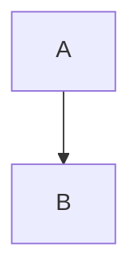

# Documents

## How to write docs

### YAML front matter

```yaml
name: doc name
description: doc description
tags: [tag1, tag2]
```

### Diagram

Use [mermaid](https://mermaid.js.org/) to create diagrams.



### Update map of contents

Whenever you create a new document, you should update the [map.csv](./map.csv) to add the new document to the map. AI Agent will read the [map.csv](./map.csv) to understand the structure of the documents and find the right document to read. AI Agent should always read the [map.csv](./map.csv) when it needs to find a document to read.

```csv
name,description,path
```

## How to read docs

### Read the front matter

AI Agent can read [map.csv](./map.csv) to understand the structure of the documents. It contains the metadata of each document which AI Agent can use to answer user questions and find the right document to read.
AI Agent should always read the [map.csv](./map.csv) when it needs to find a document to read.

```yaml
name: The name of the document
description: The description of the document
tags: [tag1, tag2]
```

## Plans

The "./plans/" directory contains the plan when development, before implementation or "TODO" lists. It contains:

- The step-by-step guide on how to implement a feature or fix a bug.
- Tradeoffs and pros/cons of different approaches
- Notes on what was learned during development
- What was implemented
- What was not implemented
- What needs to be done in the future
- Anything else we should know about
- Related documents

## Architecture Decision Record

ADRs are used to record important architectural decisions that have been made during the development of the project. They are used to track the evolution of the system's architecture and to provide a record of why certain decisions were made. ADRs should be written in Markdown format and should follow the template defined in the "./adr/" directory.

### When to create ADRs

ADRs should be created when:

- A new feature is being developed
- A bug is being fixed
- A design decision is being made
- A technical decision is being made
- A architectural decision is being made
- Any decision that has a significant impact on the system should be recorded as an ADR.

### ADR Template

ADR files should use .md format and should follow the template defined in the "./adr/" directory. Here is an example of an ADR file:

```markdown
---
name: ADR Name
description: ADR Description
tags: [tag1, tag2]
---

# ADR Name

## Description

## Context

## Decision

## Rationale

## Consequences
```
